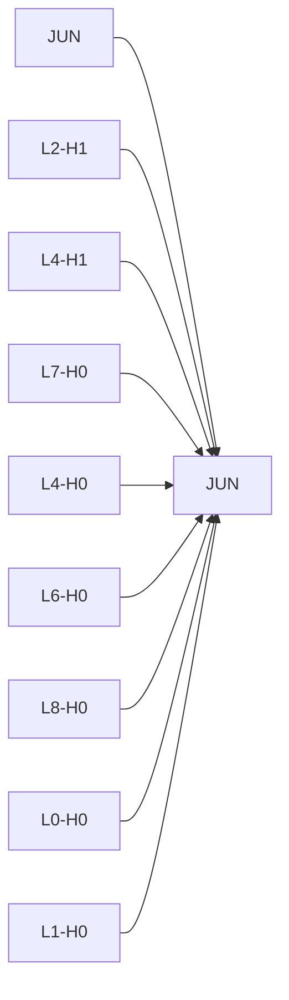
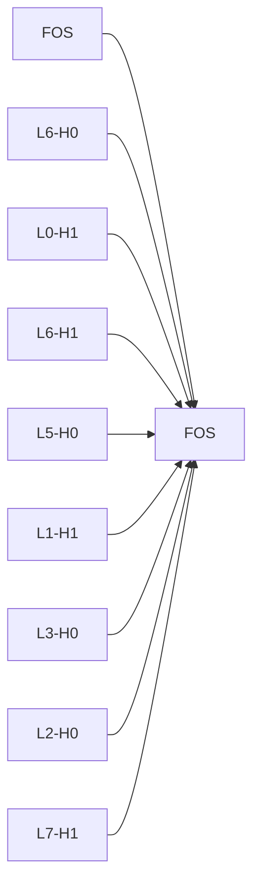

# Causal Intervention Case Studies

## JUN -> JUN
- mean effect: -1.4503 ± 0.5645 (n=8)
- label: 1
- top components: L2-H1:0.123, L4-H1:0.116, L7-H0:0.081, L4-H0:-0.063, L6-H0:0.058, L8-H0:0.055, L0-H0:0.050, L1-H0:-0.045

## FOS -> FOS
- mean effect: -0.0478 ± 1.3174 (n=8)
- label: 1
- top components: L6-H0:0.138, L0-H1:-0.087, L6-H1:-0.071, L5-H0:0.070, L1-H1:0.063, L3-H0:0.054, L2-H0:-0.051, L7-H1:-0.043

