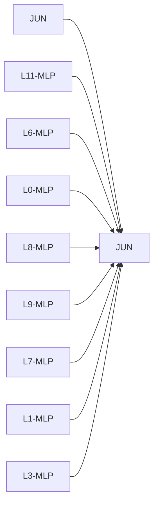
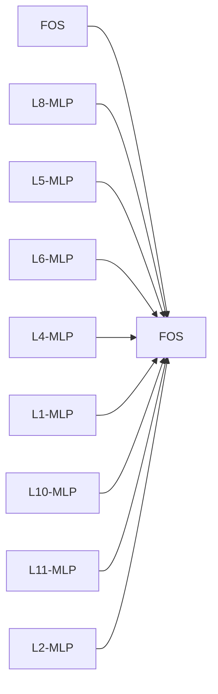

# Causal Intervention Case Studies

## JUN -> JUN
- mean effect: -1.4503 ± 0.5645 (n=8)
- label: 1
- top components: L11-MLP:0.330, L6-MLP:0.310, L0-MLP:0.273, L8-MLP:0.272, L9-MLP:0.254, L7-MLP:0.160, L1-MLP:-0.141, L3-MLP:0.125

## FOS -> FOS
- mean effect: -0.0478 ± 1.3174 (n=8)
- label: 1
- top components: L8-MLP:0.717, L5-MLP:0.353, L6-MLP:0.338, L4-MLP:0.254, L1-MLP:-0.199, L10-MLP:0.124, L11-MLP:0.124, L2-MLP:-0.097

