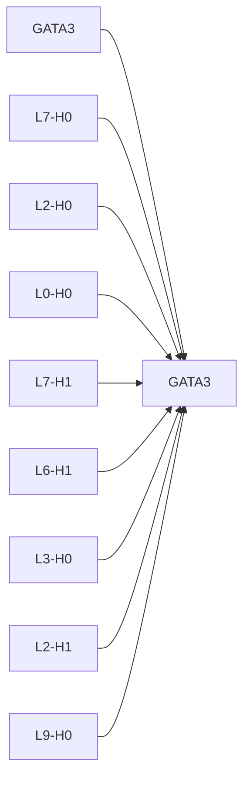
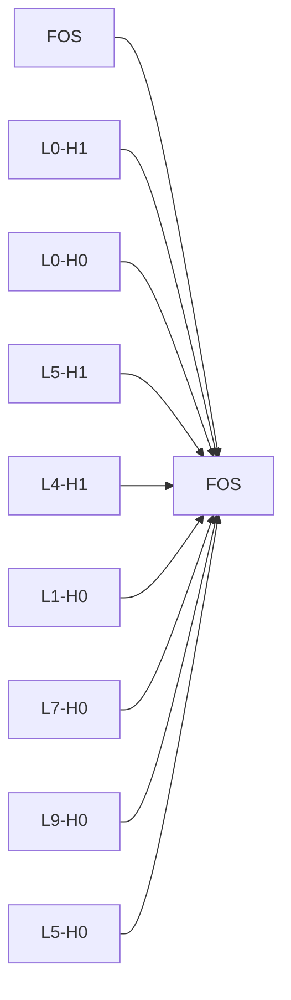
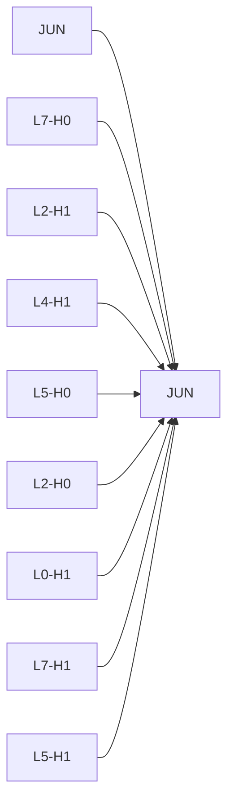
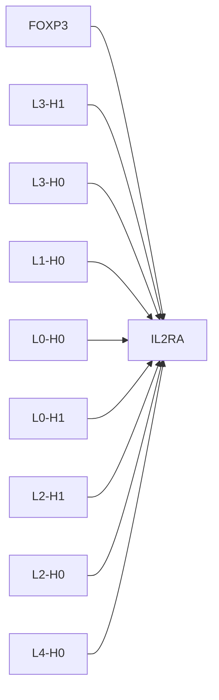
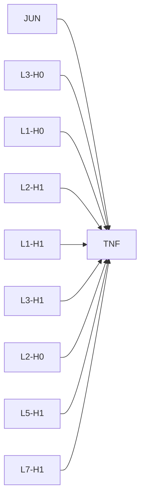

# Causal Intervention Case Studies

## GATA3 -> GATA3
- mean effect: -1.0681 ± 0.7279 (n=5)
- label: 1
- top components: L7-H0:0.364, L2-H0:-0.266, L0-H0:0.231, L7-H1:0.229, L6-H1:-0.204, L3-H0:-0.188, L2-H1:0.151, L9-H0:0.121

## FOS -> FOS
- mean effect: 0.8637 ± 0.6095 (n=8)
- label: 1
- top components: L0-H1:0.085, L0-H0:0.070, L5-H1:-0.064, L4-H1:-0.059, L1-H0:0.053, L7-H0:-0.045, L9-H0:-0.037, L5-H0:-0.037

## JUN -> JUN
- mean effect: -0.4194 ± 0.7276 (n=7)
- label: 1
- top components: L7-H0:0.128, L2-H1:0.121, L4-H1:0.089, L5-H0:0.084, L2-H0:0.081, L0-H1:-0.080, L7-H1:0.066, L5-H1:0.066

## FOXP3 -> IL2RA
- mean effect: -0.2687 ± 0.0000 (n=1)
- label: 1
- top components: L3-H1:-0.046, L3-H0:0.040, L1-H0:0.022, L0-H0:0.020, L0-H1:0.017, L2-H1:0.013, L2-H0:-0.013, L4-H0:-0.003

## JUN -> TNF
- mean effect: -0.1734 ± 0.0000 (n=1)
- label: 1
- top components: L3-H0:0.104, L1-H0:-0.067, L2-H1:0.063, L1-H1:0.059, L3-H1:0.053, L2-H0:0.046, L5-H1:0.042, L7-H1:-0.021

