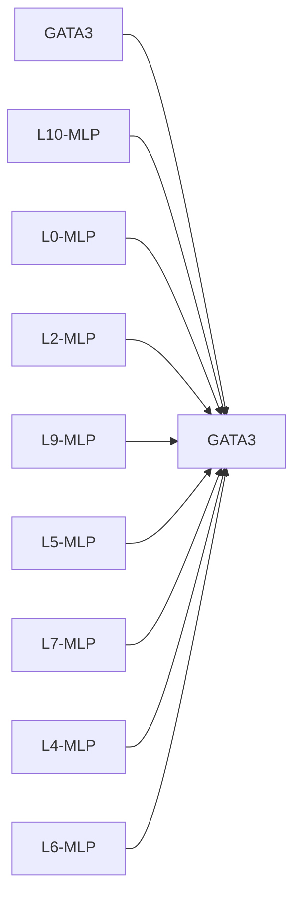
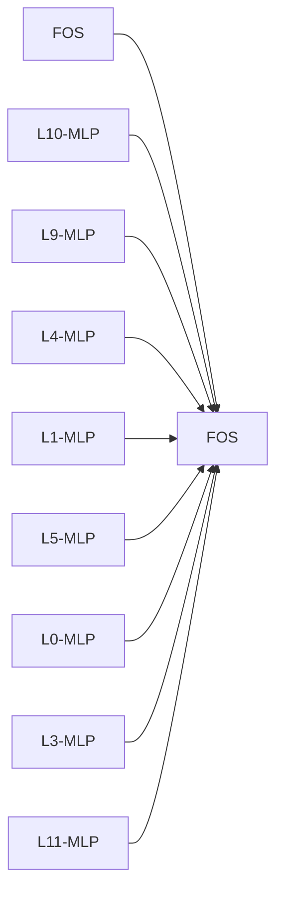
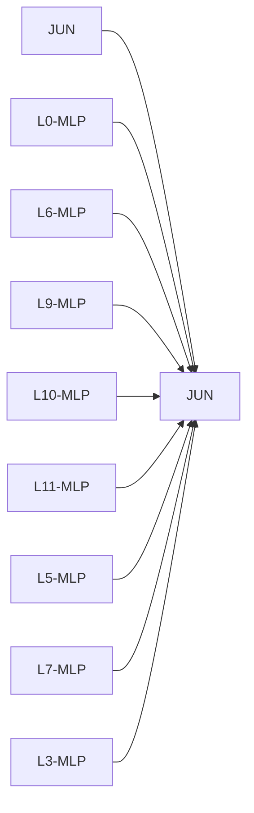
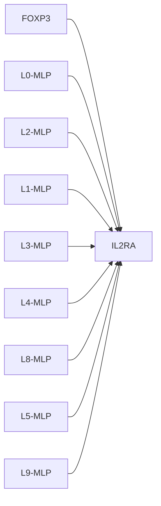
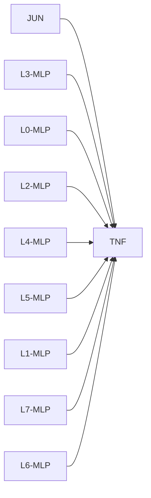

# Causal Intervention Case Studies

## GATA3 -> GATA3
- mean effect: -1.0681 ± 0.7279 (n=5)
- label: 1
- top components: L10-MLP:1.962, L0-MLP:-1.936, L2-MLP:-1.652, L9-MLP:1.441, L5-MLP:1.107, L7-MLP:-1.028, L4-MLP:-0.926, L6-MLP:-0.809

## FOS -> FOS
- mean effect: 0.8637 ± 0.6095 (n=8)
- label: 1
- top components: L10-MLP:0.301, L9-MLP:0.257, L4-MLP:-0.246, L1-MLP:0.199, L5-MLP:0.199, L0-MLP:0.171, L3-MLP:0.100, L11-MLP:0.096

## JUN -> JUN
- mean effect: -0.4194 ± 0.7276 (n=7)
- label: 1
- top components: L0-MLP:0.819, L6-MLP:0.401, L9-MLP:0.364, L10-MLP:0.283, L11-MLP:0.234, L5-MLP:-0.209, L7-MLP:0.189, L3-MLP:0.104

## FOXP3 -> IL2RA
- mean effect: -0.2687 ± 0.0000 (n=1)
- label: 1
- top components: L0-MLP:0.037, L2-MLP:-0.032, L1-MLP:0.031, L3-MLP:-0.020, L4-MLP:0.011, L8-MLP:0.010, L5-MLP:0.007, L9-MLP:0.007

## JUN -> TNF
- mean effect: -0.1734 ± 0.0000 (n=1)
- label: 1
- top components: L3-MLP:0.430, L0-MLP:0.382, L2-MLP:0.246, L4-MLP:-0.222, L5-MLP:0.136, L1-MLP:-0.077, L7-MLP:-0.038, L6-MLP:-0.025

