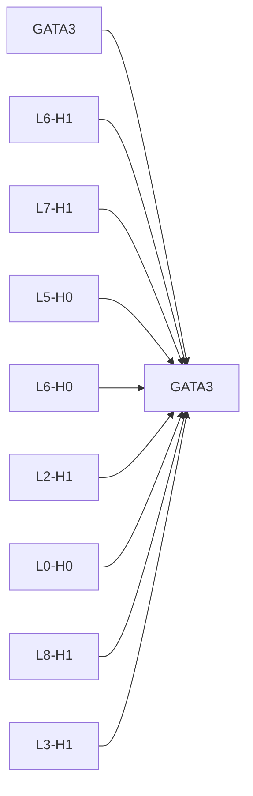

# Causal Intervention Case Studies

## GATA3 -> GATA3
- mean effect: -0.2488 ± 0.2018 (n=3)
- label: 1
- top components: L6-H1:-0.608, L7-H1:0.482, L5-H0:0.349, L6-H0:-0.285, L2-H1:0.283, L0-H0:-0.223, L8-H1:0.210, L3-H1:0.208

