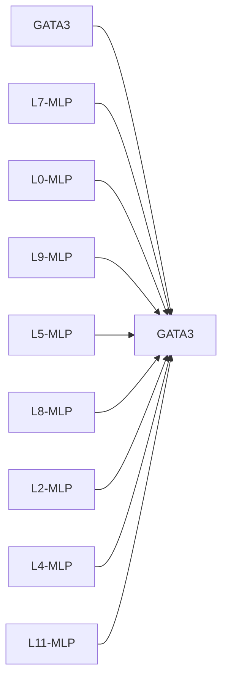

# Causal Intervention Case Studies

## GATA3 -> GATA3
- mean effect: -0.2488 ± 0.2018 (n=3)
- label: 1
- top components: L7-MLP:1.619, L0-MLP:-1.573, L9-MLP:1.556, L5-MLP:1.373, L8-MLP:1.367, L2-MLP:-1.345, L4-MLP:1.240, L11-MLP:0.928

