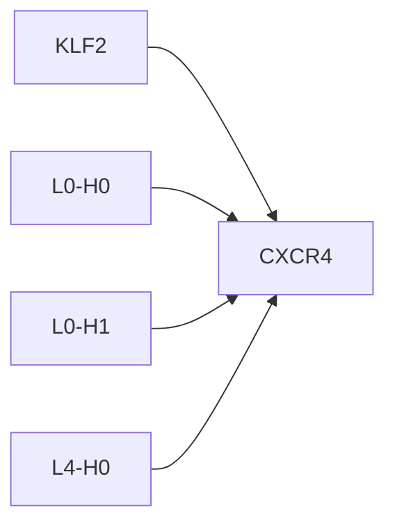
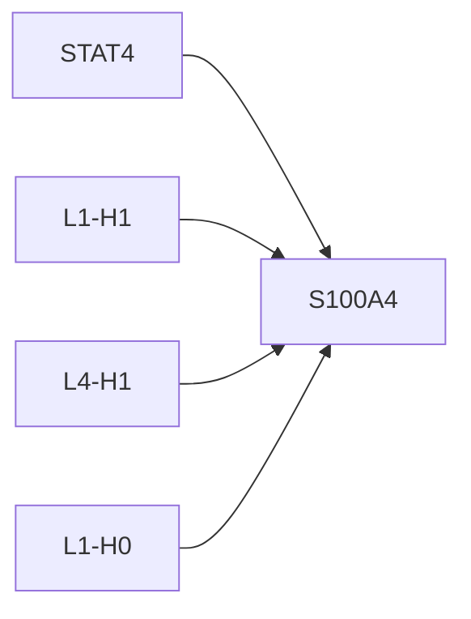

# Causal Intervention Case Studies

## KLF2 -> CXCR4
- mean effect: -0.1570 ± 0.1424 (n=12)
- label: 1
- top components: L0-H0:-0.098, L0-H1:0.082, L4-H0:-0.061

## STAT4 -> S100A4
- mean effect: 0.0509 ± 0.1753 (n=9)
- label: 1
- top components: L1-H1:0.039, L4-H1:0.029, L1-H0:0.026

