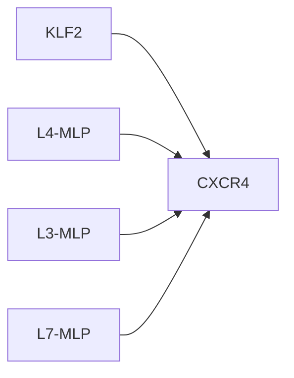
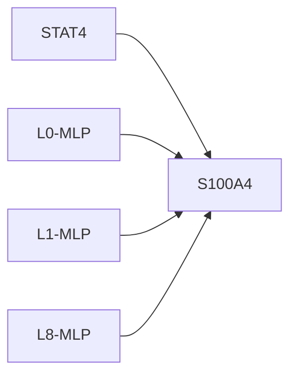

# Causal Intervention Case Studies

## KLF2 -> CXCR4
- mean effect: -0.1570 ± 0.1424 (n=12)
- label: 1
- top components: L4-MLP:-0.408, L3-MLP:-0.351, L7-MLP:-0.154

## STAT4 -> S100A4
- mean effect: 0.0509 ± 0.1753 (n=9)
- label: 1
- top components: L0-MLP:0.429, L1-MLP:-0.102, L8-MLP:-0.088

