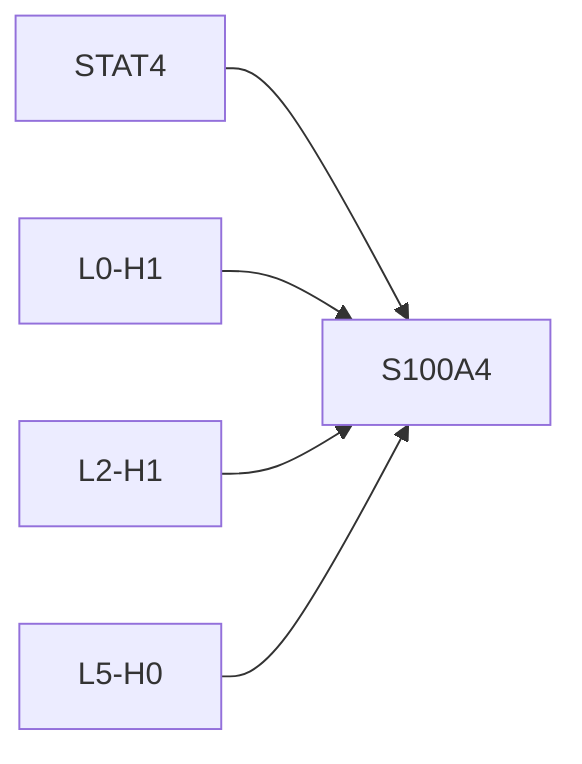
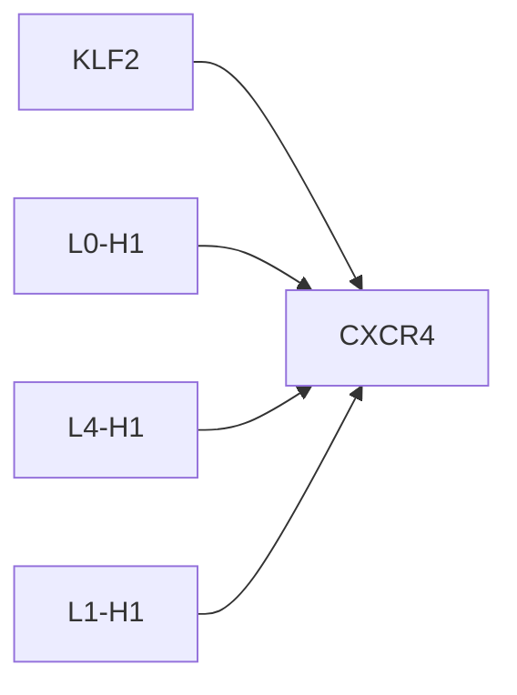

# Causal Intervention Case Studies

## STAT4 -> S100A4
- mean effect: 0.0726 ± 0.0523 (n=6)
- label: 1
- top components: L0-H1:0.056, L2-H1:0.027, L5-H0:0.020

## KLF2 -> CXCR4
- mean effect: -0.0315 ± 0.0273 (n=12)
- label: 1
- top components: L0-H1:-6.132, L4-H1:1.897, L1-H1:1.468

