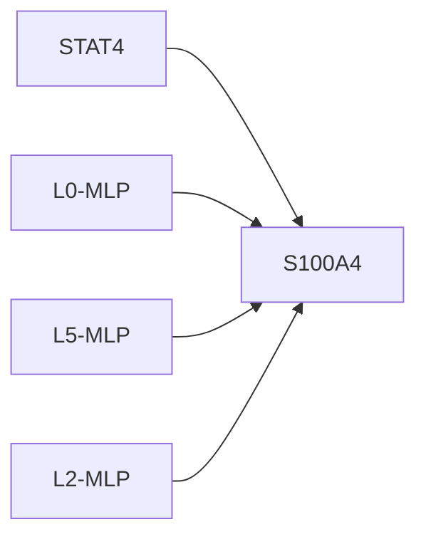
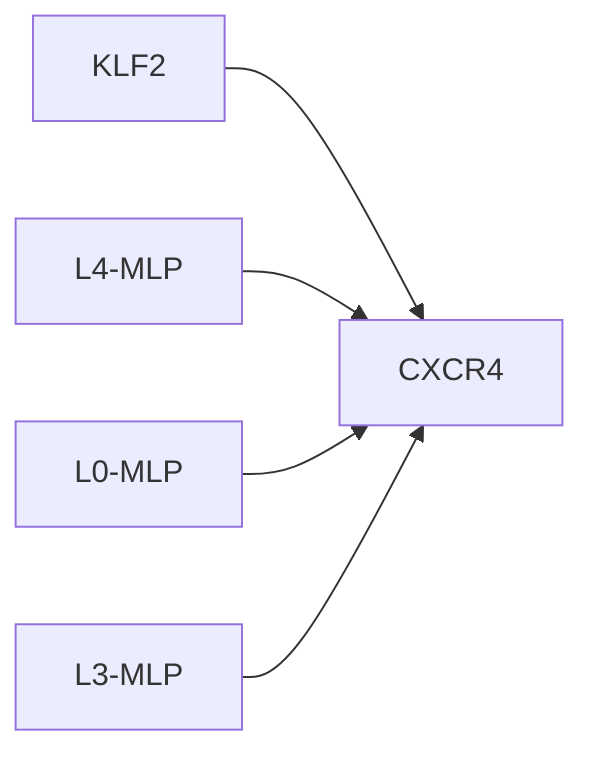

# Causal Intervention Case Studies

## STAT4 -> S100A4
- mean effect: 0.0726 ± 0.0523 (n=6)
- label: 1
- top components: L0-MLP:0.313, L5-MLP:0.090, L2-MLP:-0.048

## KLF2 -> CXCR4
- mean effect: -0.0315 ± 0.0273 (n=12)
- label: 1
- top components: L4-MLP:18.423, L0-MLP:12.362, L3-MLP:9.699

