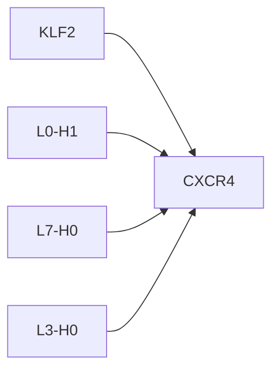
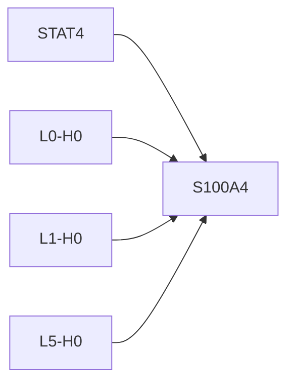

# Causal Intervention Case Studies

## KLF2 -> CXCR4
- mean effect: -0.0818 ± 0.1602 (n=11)
- label: 1
- top components: L0-H1:0.150, L7-H0:-0.124, L3-H0:-0.119

## STAT4 -> S100A4
- mean effect: -0.0009 ± 0.0015 (n=2)
- label: 1
- top components: L0-H0:0.289, L1-H0:0.237, L5-H0:0.172

