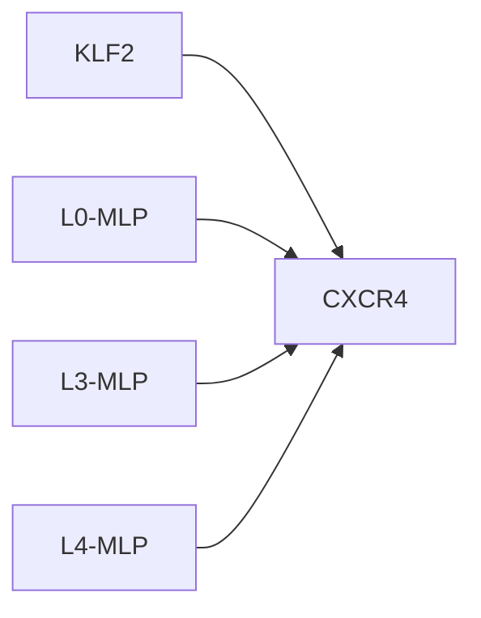
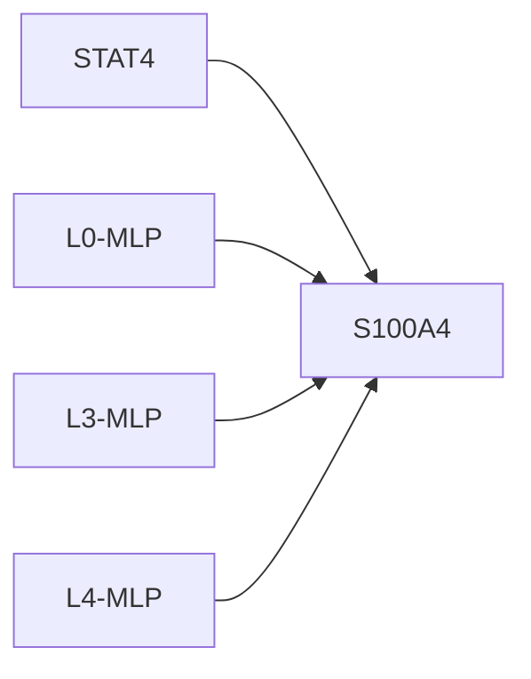

# Causal Intervention Case Studies

## KLF2 -> CXCR4
- mean effect: -0.0818 ± 0.1602 (n=11)
- label: 1
- top components: L0-MLP:-0.860, L3-MLP:-0.671, L4-MLP:-0.522

## STAT4 -> S100A4
- mean effect: -0.0009 ± 0.0015 (n=2)
- label: 1
- top components: L0-MLP:-0.789, L3-MLP:-0.702, L4-MLP:0.654

